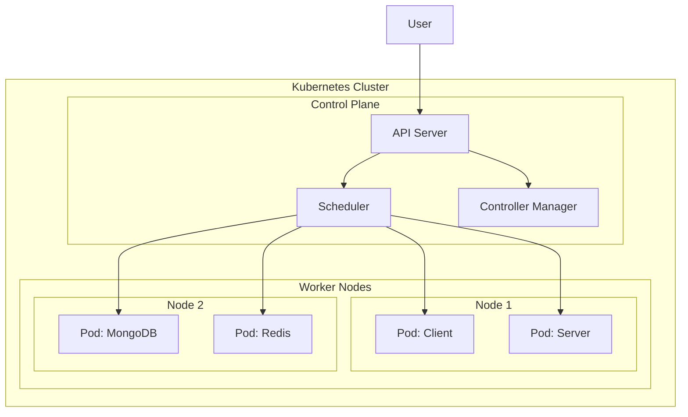
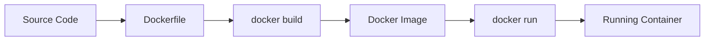

# Hướng Dẫn Kubernetes Từ Con Số 0 - Dự Án PingUp

> **Mục tiêu**: Deploy dự án PingUp (React + Node.js + MongoDB + Redis) lên Kubernetes cluster local

## 📚 Mục Lục
1. [Kubernetes là gì?](#kubernetes-là-gì)
2. [Cài đặt Prerequisites](#bước-1-cài-đặt-prerequisites)
3. [Containerize ứng dụng với Docker](#bước-2-containerize-ứng-dụng)
4. [Tạo Kubernetes Manifests](#bước-3-tạo-kubernetes-manifests)
5. [Deploy lên Kubernetes](#bước-4-deploy-lên-kubernetes)
6. [Verify và Test](#bước-5-verify-và-test)
7. [Troubleshooting](#troubleshooting)

---

## Kubernetes là gì?

**Kubernetes (K8s)** là một platform mã nguồn mở để tự động hóa việc deploy, scale và quản lý các containerized applications.

### Tại sao cần Kubernetes?

| Vấn đề truyền thống | Giải pháp Kubernetes |
|---------------------|----------------------|
| Deploy thủ công trên nhiều servers | Tự động deploy và distribute containers |
| Khó scale khi traffic tăng | Auto-scaling dựa trên CPU/Memory |
| Downtime khi update | Zero-downtime rolling updates |
| Phức tạp khi quản lý nhiều services | Centralized management và orchestration |

### Kiến trúc Kubernetes cơ bản



### Các khái niệm quan trọng

- **Pod**: Đơn vị nhỏ nhất trong K8s, chứa 1 hoặc nhiều containers
- **Deployment**: Quản lý việc tạo và update Pods
- **Service**: Expose Pods ra bên ngoài với stable IP/DNS
- **ConfigMap**: Lưu trữ configuration data (non-sensitive)
- **Secret**: Lưu trữ sensitive data (passwords, tokens)
- **Namespace**: Logical isolation cho resources
- **Ingress**: HTTP/HTTPS routing từ bên ngoài vào cluster

---

## Bước 1: Cài đặt Prerequisites

### 1.1. Cài đặt Docker Desktop

Docker Desktop bao gồm cả Docker Engine và Kubernetes.

**Windows:**
1. Download Docker Desktop: https://www.docker.com/products/docker-desktop
2. Chạy installer và follow hướng dẫn
3. Restart máy tính nếu cần
4. Mở Docker Desktop

**Verify installation:**
```bash
docker --version
# Output: Docker version 24.x.x
```

### 1.2. Enable Kubernetes trong Docker Desktop

1. Mở **Docker Desktop**
2. Click vào **Settings** (icon bánh răng)
3. Chọn **Kubernetes** tab
4. Check ✅ **Enable Kubernetes**
5. Click **Apply & Restart**
6. Đợi ~5-10 phút để Kubernetes khởi động (icon K8s sẽ chuyển sang màu xanh)

**Verify Kubernetes:**
```bash
kubectl version --client
# Output: Client Version: v1.x.x

kubectl cluster-info
# Output: Kubernetes control plane is running at https://kubernetes.docker.internal:6443
```

### 1.3. Cài đặt kubectl (nếu chưa có)

kubectl đã được cài sẵn với Docker Desktop. Nếu cần cài riêng:

**Windows (PowerShell):**
```powershell
# Download kubectl
curl.exe -LO "https://dl.k8s.io/release/v1.28.0/bin/windows/amd64/kubectl.exe"

# Add to PATH hoặc move vào C:\Windows\System32\
```

### 1.4. Cài đặt Helm (Optional nhưng recommended)

Helm là package manager cho Kubernetes.

**Windows (PowerShell):**
```powershell
# Using Chocolatey
choco install kubernetes-helm

# Or download binary từ: https://github.com/helm/helm/releases
```

**Verify:**
```bash
helm version
```

---

## Bước 2: Containerize Ứng Dụng

Trước khi deploy lên Kubernetes, cần đóng gói ứng dụng thành Docker images.

### 2.1. Hiểu về Docker Architecture



### 2.2. Tạo Dockerfile cho Client (React)

**File: `d:\Ping\client\Dockerfile`**

Dockerfile này sử dụng **multi-stage build** để tối ưu kích thước image:
- Stage 1: Build React app
- Stage 2: Serve với nginx

### 2.3. Tạo Dockerfile cho Server (Node.js)

**File: `d:\Ping\server\Dockerfile`**

### 2.4. Tạo .dockerignore files

Giống như `.gitignore`, file này loại trừ các files không cần thiết khỏi Docker image.

### 2.5. Build và Test Docker Images

```bash
# Build client image
cd d:\Ping\client
docker build -t pingup-client:latest .

# Build server image
cd d:\Ping\server
docker build -t pingup-server:latest .

# List images
docker images | grep pingup

# Test chạy container
docker run -p 3000:80 pingup-client:latest
# Mở browser: http://localhost:3000
```

---

## Bước 3: Tạo Kubernetes Manifests

Kubernetes sử dụng YAML files để định nghĩa resources.

### 3.1. Cấu trúc thư mục

```
d:\Ping\
├── k8s/
│   ├── namespace.yaml
│   ├── configmap.yaml
│   ├── secrets.yaml
│   ├── mongodb-deployment.yaml
│   ├── redis-deployment.yaml
│   ├── server-deployment.yaml
│   ├── client-deployment.yaml
│   ├── ingress.yaml
│   ├── deploy.sh
│   └── cleanup.sh
├── client/
│   ├── Dockerfile
│   └── .dockerignore
└── server/
    ├── Dockerfile
    └── .dockerignore
```

### 3.2. Namespace

Namespace giúp tách biệt resources của các projects khác nhau.

**File: `k8s/namespace.yaml`**

### 3.3. ConfigMap

Lưu trữ environment variables không nhạy cảm.

**File: `k8s/configmap.yaml`**

### 3.4. Secrets

Lưu trữ sensitive data (encoded base64).

**File: `k8s/secrets.yaml`**

> [!CAUTION]
> Secrets trong Kubernetes chỉ được encode base64, KHÔNG được encrypt. Trong production, nên dùng external secret managers như HashiCorp Vault hoặc AWS Secrets Manager.

### 3.5. MongoDB Deployment

**File: `k8s/mongodb-deployment.yaml`**

Sử dụng **StatefulSet** thay vì Deployment vì MongoDB cần persistent storage.

### 3.6. Redis Deployment

**File: `k8s/redis-deployment.yaml`**

### 3.7. Server Deployment

**File: `k8s/server-deployment.yaml`**

**Các khái niệm quan trọng:**
- **replicas: 2** - Chạy 2 instances của server để high availability
- **livenessProbe** - K8s sẽ restart pod nếu health check fail
- **readinessProbe** - Pod chỉ nhận traffic khi ready
- **resources** - Giới hạn CPU/Memory để tránh pod chiếm hết resources

### 3.8. Client Deployment

**File: `k8s/client-deployment.yaml`**

### 3.9. Ingress

Ingress quản lý external access vào services.

**File: `k8s/ingress.yaml`**

---

## Bước 4: Deploy Lên Kubernetes

### 4.1. Chuẩn bị Secrets

Trước tiên, cần encode các sensitive values sang base64:

```bash
# Windows PowerShell
[Convert]::ToBase64String([Text.Encoding]::UTF8.GetBytes("your-jwt-secret-here"))
[Convert]::ToBase64String([Text.Encoding]::UTF8.GetBytes("your-cloudinary-name"))
[Convert]::ToBase64String([Text.Encoding]::UTF8.GetBytes("your-cloudinary-api-key"))
[Convert]::ToBase64String([Text.Encoding]::UTF8.GetBytes("your-cloudinary-api-secret"))
```

Copy các giá trị base64 vào `k8s/secrets.yaml`.

### 4.2. Deploy tất cả resources

```bash
# Apply tất cả manifests
kubectl apply -f d:\Ping\k8s\

# Hoặc apply từng file theo thứ tự
kubectl apply -f d:\Ping\k8s\namespace.yaml
kubectl apply -f d:\Ping\k8s\configmap.yaml
kubectl apply -f d:\Ping\k8s\secrets.yaml
kubectl apply -f d:\Ping\k8s\mongodb-deployment.yaml
kubectl apply -f d:\Ping\k8s\redis-deployment.yaml
kubectl apply -f d:\Ping\k8s\server-deployment.yaml
kubectl apply -f d:\Ping\k8s\client-deployment.yaml
kubectl apply -f d:\Ping\k8s\ingress.yaml
```

### 4.3. Theo dõi deployment progress

```bash
# Watch pods starting up
kubectl get pods -n pingup -w

# Check deployment status
kubectl get deployments -n pingup

# Check services
kubectl get svc -n pingup

# Check ingress
kubectl get ingress -n pingup
```

**Expected output:**
```
NAME                      READY   STATUS    RESTARTS   AGE
client-xxxxxxxxxx-xxxxx   1/1     Running   0          2m
server-xxxxxxxxxx-xxxxx   1/1     Running   0          2m
server-xxxxxxxxxx-yyyyy   1/1     Running   0          2m
mongodb-0                 1/1     Running   0          3m
redis-xxxxxxxxxx-xxxxx    1/1     Running   0          3m
```

---

## Bước 5: Verify và Test

### 5.1. Check Pod Logs

```bash
# List all pods
kubectl get pods -n pingup

# View logs của server pod
kubectl logs -n pingup <server-pod-name>

# Follow logs real-time
kubectl logs -n pingup <server-pod-name> -f

# View logs của tất cả server replicas
kubectl logs -n pingup -l app=server
```

### 5.2. Access Application

Có 2 cách để access ứng dụng:

**Cách 1: Port Forward (Recommended cho local development)**
```bash
# Forward client service
kubectl port-forward -n pingup svc/client 3000:80

# Forward server service
kubectl port-forward -n pingup svc/server 5000:5000

# Mở browser: http://localhost:3000
```

**Cách 2: Ingress (Cần cài Ingress Controller)**
```bash
# Cài NGINX Ingress Controller
kubectl apply -f https://raw.githubusercontent.com/kubernetes/ingress-nginx/controller-v1.8.1/deploy/static/provider/cloud/deploy.yaml

# Đợi ingress controller ready
kubectl wait --namespace ingress-nginx \
  --for=condition=ready pod \
  --selector=app.kubernetes.io/component=controller \
  --timeout=120s

# Access qua: http://localhost
```

### 5.3. Test Functionality

1. **Test Frontend**: Mở http://localhost:3000
2. **Test API**: `curl http://localhost:5000/api/health`
3. **Test Database Connection**: Check server logs
4. **Test Redis**: Check server logs
5. **Test Socket.io**: Test real-time chat features

### 5.4. Exec vào Pod để debug

```bash
# Get shell access vào server pod
kubectl exec -it -n pingup <server-pod-name> -- /bin/sh

# Inside pod, check environment variables
env | grep MONGO
env | grep REDIS

# Check if MongoDB is accessible
nc -zv mongodb 27017

# Check if Redis is accessible
nc -zv redis 6379

# Exit
exit
```

---

## Troubleshooting

### Pod không start được

```bash
# Check pod status
kubectl describe pod -n pingup <pod-name>

# Common issues:
# - ImagePullBackOff: Docker image không tồn tại
# - CrashLoopBackOff: Container start rồi crash ngay
# - Pending: Không đủ resources
```

**Fix ImagePullBackOff:**
```bash
# Build lại image
docker build -t pingup-server:latest ./server

# Hoặc sử dụng imagePullPolicy: Never trong deployment
```

### MongoDB connection failed

```bash
# Check MongoDB pod logs
kubectl logs -n pingup mongodb-0

# Check if MongoDB service exists
kubectl get svc -n pingup mongodb

# Test connection từ server pod
kubectl exec -it -n pingup <server-pod-name> -- nc -zv mongodb 27017
```

### Environment variables không đúng

```bash
# Check ConfigMap
kubectl get configmap -n pingup pingup-config -o yaml

# Check Secrets
kubectl get secret -n pingup pingup-secrets -o yaml

# Update ConfigMap
kubectl edit configmap -n pingup pingup-config

# Restart pods để apply changes
kubectl rollout restart deployment -n pingup server
```

### Port forward không hoạt động

```bash
# Check if service exists
kubectl get svc -n pingup

# Check if pods are running
kubectl get pods -n pingup

# Try different port
kubectl port-forward -n pingup svc/client 8080:80
```

---

## Useful Commands Cheat Sheet

```bash
# Get all resources in namespace
kubectl get all -n pingup

# Delete all resources
kubectl delete namespace pingup

# Scale deployment
kubectl scale deployment -n pingup server --replicas=3

# Update image
kubectl set image deployment/server -n pingup server=pingup-server:v2

# Rollback deployment
kubectl rollout undo deployment -n pingup server

# View resource usage
kubectl top pods -n pingup
kubectl top nodes

# Get events
kubectl get events -n pingup --sort-by='.lastTimestamp'

# Export YAML của resource đang chạy
kubectl get deployment -n pingup server -o yaml > server-backup.yaml
```

---

## Next Steps

Sau khi đã deploy thành công lên local Kubernetes:

1. **CI/CD Pipeline**: Setup GitHub Actions để tự động build và deploy
2. **Monitoring**: Cài đặt Prometheus + Grafana
3. **Logging**: Setup ELK Stack (Elasticsearch, Logstash, Kibana)
4. **Production Deployment**: Deploy lên cloud (GKE, EKS, AKS)
5. **Helm Charts**: Convert manifests sang Helm charts để dễ quản lý

---

## Tài liệu tham khảo

- [Kubernetes Official Docs](https://kubernetes.io/docs/)
- [Docker Documentation](https://docs.docker.com/)
- [kubectl Cheat Sheet](https://kubernetes.io/docs/reference/kubectl/cheatsheet/)
- [Kubernetes Best Practices](https://kubernetes.io/docs/concepts/configuration/overview/)
