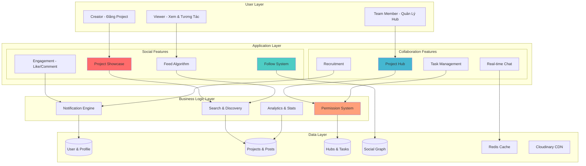

# 🚀 PingUp - Nền Tảng Mạng Xã Hội Cộng Tác Nhóm Và Quản Lý Dự Án

<div align="center">


**Một nền tảng toàn diện để quản lý dự án, tuyển dụng thành viên, theo dõi tiến độ và cộng tác nhóm trong thời gian thực.**

[Tính Năng](#-tính-năng-chính) •
[Kiến Trúc](#-kiến-trúc-hệ-thống) •
[Cài Đặt](#-cài-đặt) •
[API Documentation](#-api-documentation) •
[Deployment](#-deployment)

</div>

---

## 📋 Mục Lục

- [Giới Thiệu](#-giới-thiệu)
- [Tính Năng Chính](#-tính-năng-chính)
- [Kiến Trúc Hệ Thống](#-kiến-trúc-hệ-thống)
- [Công Nghệ Sử Dụng](#-công-nghệ-sử-dụng)
- [Cài Đặt](#-cài-đặt)
- [Cấu Hình](#-cấu-hình)
- [API Documentation](#-api-documentation)
- [Hệ Thống Phân Quyền](#-hệ-thống-phân-quyền)
- [Deployment](#-deployment)
- [Cấu Trúc Dự Án](#-cấu-trúc-dự-án)
- [Đóng Góp](#-đóng-góp)

---

## 🎯 Giới Thiệu

**PingUp** là một **mạng xã hội chuyên nghiệp** dành cho các nhà phát triển, designers và creators, kết hợp giữa **showcase portfolio** và **quản lý dự án nhóm**. Nền tảng được xây dựng với các mục tiêu chính:

### 🌟 Mạng Xã Hội Sáng Tạo
- 🎨 **Project Showcase**: Đăng và chia sẻ dự án với thiết kế giống Behance/Dribbble
- 👥 **Social Networking**: Follow creators, like, comment và tương tác
- 🔍 **Discover Feed**: Khám phá dự án trending và creators tài năng
- 💼 **Professional Profile**: Portfolio cá nhân với skills, experience và achievements

### 🚀 Quản Lý Dự Án Nhóm
- 🏢 **Project Hub**: Không gian làm việc riêng cho từng dự án
- 📊 **Task Management**: Milestone, Task, Devlog tracking chi tiết
- 👔 **Recruitment System**: Tuyển dụng và quản lý thành viên dự án
- 🔐 **Permission System**: 4 cấp độ phân quyền (Owner, Admin, Member, Viewer)

### ⚡ Tính Năng Nổi Bật
- 💬 **Real-time Chat**: Nhắn tin 1-1 và group chat với Socket.io
- 📱 **Responsive Design**: Trải nghiệm mượt mà trên mọi thiết bị
- 🚀 **Production Ready**: Containerized với Docker và Kubernetes
- 🎯 **Performance**: Redis caching, CDN, và horizontal scaling

---

## ✨ Tính Năng Chính

### � Project Showcase & Social Feed

<details>
<summary><b>Xem chi tiết</b></summary>

#### Đăng và Chia Sẻ Dự Án
- ✅ **Rich Content Editor**: Tạo project với nhiều block types
  - Text blocks với custom styling (font, size, color, alignment)
  - Image/Photo grid với lightbox view
  - Video embeds và media
  - Prototype previews và 3D models
  - Custom layouts và spacing
- ✅ **Cover Image**: Upload ảnh bìa chất lượng cao qua Cloudinary
- ✅ **Tags & Categories**: Phân loại dự án theo lĩnh vực
- ✅ **Visibility Control**: Public, Connections only, hoặc Private
- ✅ **Draft/Published Status**: Lưu nháp trước khi publish

#### Social Engagement
- ✅ **Like System**: Thả tim cho dự án yêu thích
- ✅ **Comments**: Bình luận và thảo luận trên dự án
- ✅ **Comment Likes**: Like các comment hay
- ✅ **Views Counter**: Theo dõi lượt xem dự án
- ✅ **Share**: Chia sẻ dự án ra ngoài

#### Discovery Feed
- ✅ **Feed Algorithm**: Hiển thị dự án từ người bạn follow
- ✅ **Discover Page**: Khám phá dự án trending và mới nhất
- ✅ **Category Filters**: Lọc theo lĩnh vực (Design, Dev, Art, etc.)
- ✅ **Search**: Tìm kiếm dự án theo keyword, tags
- ✅ **Trending Projects**: Dự án có nhiều tương tác

</details>

### 👤 Professional Profile & Portfolio

<details>
<summary><b>Xem chi tiết</b></summary>

#### Thông Tin Cá Nhân
- ✅ **Profile Setup**: Name, job title, bio, location
- ✅ **Avatar & Cover**: Upload hình đại diện và ảnh bìa
- ✅ **Contact Info**: Website, email, social links
- ✅ **Skills Tags**: Hiển thị expertise (React, UI/UX, Python, etc.)

#### Portfolio Management
- ✅ **Project Gallery**: Tất cả dự án đã publish
- ✅ **Portfolio Items**: Upload work samples (images, videos, PDFs)
- ✅ **Work Experience**: Thêm kinh nghiệm làm việc
  - Job title, company, duration
  - Responsibilities và achievements
- ✅ **Education**: Background học vấn
- ✅ **Certifications**: Chứng chỉ và awards

#### Social Stats
- ✅ **Followers/Following Count**: Thống kê người theo dõi
- ✅ **Total Likes**: Tổng likes trên tất cả dự án
- ✅ **Total Views**: Tổng lượt xem
- ✅ **Projects Count**: Số lượng dự án đã đăng
- ✅ **Activity Timeline**: Lịch sử hoạt động

</details>

### 🤝 Follow & Networking

<details>
<summary><b>Xem chi tiết</b></summary>

#### Follow System
- ✅ **Follow/Unfollow Users**: Theo dõi creators yêu thích
- ✅ **Followers List**: Xem ai đang follow bạn
- ✅ **Following List**: Danh sách người bạn follow
- ✅ **Follow Suggestions**: Gợi ý người nên follow
- ✅ **Mutual Connections**: Hiển thị bạn chung

#### Network Building
- ✅ **Topic Selection**: Chọn interests khi onboarding
- ✅ **Discover People**: Tìm kiếm creators theo skills/category
- ✅ **Follow Status**: Hiển thị trạng thái following trên profile
- ✅ **Activity Notifications**: Thông báo khi người follow có hoạt động mới

</details>

### �🏢 Project Hub Management

<details>
<summary><b>Xem chi tiết</b></summary>

- ✅ Tạo và quản lý Project Hub
- ✅ Thêm/xóa thành viên với các vai trò khác nhau
- ✅ Cập nhật thông tin hub (tên, mô tả, hình ảnh)
- ✅ Dashboard tổng quan về tiến độ dự án
- ✅ Activity feed theo dõi mọi hoạt động

</details>

### 👨‍💼 Recruitment System

<details>
<summary><b>Xem chi tiết</b></summary>

- ✅ Đăng tin tuyển dụng vị trí trong project
- ✅ Quản lý ứng viên (chấp nhận/từ chối)
- ✅ Review và comment trên applications
- ✅ Tự động thêm thành viên khi chấp nhận
- ✅ Notifications cho mọi cập nhật

</details>

### 📈 Task Management

<details>
<summary><b>Xem chi tiết</b></summary>

- ✅ **Milestones**: Tạo các mốc quan trọng cho dự án
  - Đặt deadline và mục tiêu
  - Theo dõi completion rate
  - Gán tasks vào milestone
  
- ✅ **Tasks**: Quản lý công việc chi tiết
  - Gán cho thành viên
  - Priority levels (High, Medium, Low)
  - Status tracking (Todo, In Progress, Done)
  - Due dates và reminders
  
- ✅ **Devlogs**: Nhật ký phát triển
  - Ghi chép tiến độ hàng ngày
  - Upload hình ảnh minh họa
  - Markdown support
  - Timeline view

</details>

### 💬 Real-time Chat

<details>
<summary><b>Xem chi tiết</b></summary>

- ✅ Chat 1-1 giữa các thành viên
- ✅ Group chat cho project hub
- ✅ Socket.io với Redis adapter (scalable)
- ✅ Typing indicators
- ✅ Online/offline status
- ✅ Message history với pagination

</details>

### 👤 User Profile & Social

<details>
<summary><b>Xem chi tiết</b></summary>

- ✅ Trang profile cá nhân với bio
- ✅ Upload avatar lên Cloudinary
- ✅ Follow/unfollow users
- ✅ Activity feed cá nhân
- ✅ Portfolio dự án đã tham gia
- ✅ Skills và expertise tags

</details>

### 🔐 Authentication & Security

<details>
<summary><b>Xem chi tiết</b></summary>

- ✅ JWT-based authentication
- ✅ Bcrypt password hashing
- ✅ Protected routes với middleware
- ✅ Role-based access control (RBAC)
- ✅ Session management với Redis
- ✅ Helmet.js security headers

</details>

---

## 🏗️ Kiến Trúc Hệ Thống

### Tổng Quan Kiến Trúc



### Luồng Nghiệp Vụ Chính

#### 1. 🎨 Luồng Đăng Project & Social Engagement

```
Creator → Upload Project
    ↓
[1] Tạo Draft với Rich Content Blocks
    ↓
[2] Upload Media → Cloudinary CDN
    ↓
[3] Set Visibility & Tags
    ↓
[4] Publish → Feed của Followers
    ↓
[5] Viewers: Like/Comment/Share
    ↓
[6] Notifications → Creator
    ↓
[7] Analytics: Views, Engagement Rate
```

#### 2. 👥 Luồng Follow & Discovery

```
User → Browse Feed/Discover
    ↓
[1] View Projects từ Algorithm
    ↓
[2] Follow Creator
    ↓
[3] Update Social Graph (Followers/Following)
    ↓
[4] Feed personalized theo Following
    ↓
[5] Receive Notifications về hoạt động mới
```

#### 3. 🏢 Luồng Tạo Project Hub & Recruitment

```
Owner → Create Project Hub
    ↓
[1] Link với Showcase Project
    ↓
[2] Add Milestones & Tasks
    ↓
[3] Post Recruitment cho vị trí cần
    ↓
[4] Users Apply với Cover Letter
    ↓
[5] Owner/Admin Review Applications
    ↓
[6] Accept → Auto add Member với Role
    ↓
[7] Member collaborate với permissions
```

#### 4. 🔐 Luồng Phân Quyền Đa Tầng

```
User Request → Authentication Check
    ↓
[1] Verify JWT Token
    ↓
[2] Load User Permissions
    ↓
[3] Check Hub Membership & Role
    ↓
[4] Validate Action Permission
    ↓
    ├─ Owner: Full Access
    ├─ Admin: Management Access
    ├─ Member: Contributor Access
    └─ Viewer: Read-only Access
    ↓
[5] Execute Action hoặc Return 403
```

---

## � Data Models & Business Rules

### Core Entities

#### 👤 User & UserProfile
```javascript
User (Authentication)
├── username, email, password (hashed)
├── followers: [UserId] - Người follow mình
├── following: [UserId] - Người mình follow
└── profile → UserProfile

UserProfile (Public Info)
├── Basic Info: name, jobTitle, bio, location
├── Media: avatarUrl, coverImageUrl
├── Portfolio: [portfolioItems]
├── Experience: [work history]
├── Skills: [skill tags]
└── Stats: computed from Projects
```

#### 🎨 Project (Showcase)
```javascript
Project
├── Content: title, description, blocks[]
│   └── Block types: text, image, video, embed, 3d
├── Metadata: tags[], category, toolsUsed
├── Ownership: owner (User)
├── Engagement:
│   ├── likes: [UserId]
│   ├── comments → Comment collection
│   └── views: Number
├── Visibility: everyone | connections | private
├── Status: draft | published | archived
└── Optional: projectHubId (if managed in Hub)
```

#### 🏢 ProjectHub (Collaboration Space)
```javascript
ProjectHub
├── Basic: name, description, coverImage
├── Link: project (showcase)
├── Members: [{
│   user, 
│   permissionRole: owner|admin|member|viewer,
│   jobPosition
│   }]
├── Children:
│   ├── recruitments[]
│   ├── milestones[]
│   ├── tasks[]
│   └── devlogs[]
└── Activity: hubActivities[]
```

#### 💼 Recruitment & Application
```javascript
Recruitment
├── projectHub
├── position, description, requirements[]
├── slots: available positions
└── status: open | closed

Application
├── recruitment, applicant (User)
├── coverLetter
├── status: pending | reviewing | accepted | rejected
└── feedback from reviewers
```

### Business Rules

<details>
<summary><b>📋 Project Showcase Rules</b></summary>

1. **Visibility Logic**
   - `everyone`: Public, hiển thị trong Feed & Discover
   - `connections`: Chỉ followers xem được
   - `private`: Chỉ owner xem được

2. **Publishing Rules**
   - Draft không hiện trong Feed
   - Published → auto set publishedAt timestamp
   - Archived không search được

3. **Engagement Rules**
   - 1 user chỉ like 1 lần per project/comment
   - View count tăng mỗi lần unique user xem
   - Comment có thể nested (replies)

</details>

<details>
<summary><b>🤝 Follow System Rules</b></summary>

1. **Follow Logic**
   - Không thể follow chính mình
   - Follow là one-way (không cần accept)
   - Unfollow không notify

2. **Feed Algorithm**
   - Hiển thị projects từ people bạn follow
   - Sort by: publishedAt DESC
   - Filter: chỉ status=published, visibility=everyone/connections

3. **Privacy**
   - Followers/Following list có thể set private
   - Connection-only posts chỉ followers xem được

</details>

<details>
<summary><b>🏢 Project Hub Rules</b></summary>

1. **Creation Rules**
   - Chỉ project owner mới tạo Hub cho project đó
   - Owner tự động thành member đầu tiên
   - Owner không thể bị remove

2. **Permission Inheritance**
   ```
   Owner > Admin > Member > Viewer
   ```
   - Owner: Mọi quyền + xóa Hub
   - Admin: Manage members, recruitment, content
   - Member: Create/Edit tasks, milestones, devlogs
   - Viewer: Read-only

3. **Recruitment Flow**
   - Chỉ Admin/Owner post recruitment
   - Anyone có thể apply
   - Accept application → auto add as Member
   - Reject application → can provide feedback

4. **Task Dependencies**
   - Tasks phải belong to Milestone
   - Task assignee phải là Hub member
   - Complete all tasks → Milestone auto-complete

</details>

<details>
<summary><b>💬 Chat System Rules</b></summary>

1. **Conversation Types**
   - Direct: 1-1 chat giữa users
   - Group: Hub-based group chat

2. **Access Control**
   - Direct: Chỉ 2 participants
   - Group: Chỉ Hub members theo role

3. **Real-time Features**
   - Typing indicators (3s timeout)
   - Online/offline status
   - Message delivery status
   - Read receipts (optional)

</details>

---

## �🛠️ Công Nghệ Sử Dụng

### Frontend

| Technology | Version | Purpose |
|------------|---------|---------|
| **React** | 19.1.1 | UI Framework |
| **Vite** | 7.1.14 | Build Tool (Rolldown) |
| **TailwindCSS** | 4.1.16 | Styling |
| **React Router** | 7.9.5 | Routing |
| **Axios** | 1.13.1 | HTTP Client |
| **Socket.io Client** | 4.8.3 | Real-time Communication |
| **Lucide React** | 0.548.0 | Icons |
| **React Hot Toast** | 2.6.0 | Notifications |

### Backend

| Technology | Version | Purpose |
|------------|---------|---------|
| **Node.js** | Latest (ESM) | Runtime |
| **Express** | 5.1.0 | Web Framework |
| **MongoDB** | 8.19.2 (Mongoose) | Database |
| **Redis** | 5.10.0 | Caching & Session |
| **Socket.io** | 4.8.1 | WebSocket Server |
| **JWT** | 9.0.3 | Authentication |
| **Bcrypt** | 6.0.0 | Password Hashing |
| **Cloudinary** | 1.41.3 | File Storage |
| **Multer** | 2.0.2 | File Upload |
| **Helmet** | 8.1.0 | Security |
| **Zod** | 4.2.1 | Validation |

### DevOps

| Technology | Purpose |
|------------|---------|
| **Docker** | Containerization |
| **Kubernetes** | Orchestration |
| **Nginx** | Reverse Proxy & Ingress |
| **PowerShell/Bash** | Deployment Scripts |

---

## 🚀 Cài Đặt

### Prerequisites

Đảm bảo bạn đã cài đặt:

- **Node.js** >= 18.x
- **MongoDB** >= 6.x (hoặc MongoDB Atlas)
- **Redis** >= 7.x (optional, cho chat scaling)
- **Docker** & **Docker Compose** (cho containerization)
- **kubectl** (cho Kubernetes deployment)

### 1. Clone Repository

```bash
git clone https://github.com/Canh3005/PingUp.git
cd PingUp
```

### 2. Cài Đặt Dependencies

#### Backend

```bash
cd server
npm install
```

#### Frontend

```bash
cd client
npm install
```

### 3. Cấu Hình Environment Variables

#### Backend (`server/.env`)

```env
# Server
NODE_ENV=development
PORT=3000

# Database
MONGODB_URI=mongodb://localhost:27017/pingup

# JWT
JWT_SECRET=your-super-secret-jwt-key-change-this

# CORS
CORS_ORIGIN=http://localhost:5173

# Redis (optional)
REDIS_URL=redis://localhost:6379
ENABLE_REDIS_ADAPTER=false

# Cloudinary
CLOUDINARY_CLOUD_NAME=your-cloud-name
CLOUDINARY_API_KEY=your-api-key
CLOUDINARY_API_SECRET=your-api-secret
```

#### Frontend (`client/.env`)

```env
VITE_API_URL=http://localhost:3000/api
VITE_SOCKET_URL=http://localhost:3000
```

### 4. Chạy Ứng Dụng

#### Development Mode

**Terminal 1 - Backend:**
```bash
cd server
npm run dev
```

**Terminal 2 - Frontend:**
```bash
cd client
npm run dev
```

Truy cập: **http://localhost:5173**

#### Production Mode

```bash
# Build frontend
cd client
npm run build

# Serve với Express
cd ../server
npm start
```

---

## ⚙️ Cấu Hình

### MongoDB Setup

#### Local MongoDB

```bash
# Start MongoDB service
mongod --dbpath /path/to/data
```

#### MongoDB Atlas (Cloud)

1. Tạo account tại [MongoDB Atlas](https://www.mongodb.com/cloud/atlas)
2. Tạo cluster miễn phí
3. Lấy connection string
4. Update `MONGODB_URI` trong `.env`

### Redis Setup (Optional)

Redis được sử dụng cho:
- Socket.io adapter (scaling)
- Session storage
- Caching

```bash
# Install Redis
# Windows: https://github.com/microsoftarchive/redis/releases
# Linux: sudo apt-get install redis-server
# macOS: brew install redis

# Start Redis
redis-server

# Test connection
redis-cli ping
# Should return: PONG
```

### Cloudinary Setup

1. Đăng ký tại [Cloudinary](https://cloudinary.com/)
2. Lấy thông tin từ Dashboard
3. Update credentials trong `.env`

---

## 📚 API Documentation

### Base URL

```
Development: http://localhost:3000/api
Production: https://your-domain.com/api
```

### Authentication

Tất cả protected routes yêu cầu JWT token trong header:

```http
Authorization: Bearer <your-jwt-token>
```

### API Endpoints Overview

<details>
<summary><b>🔐 Authentication & User Management</b></summary>

| Endpoint | Method | Purpose | Auth Required |
|----------|--------|---------|---------------|
| `/api/auth/register` | POST | Đăng ký tài khoản mới | ❌ |
| `/api/auth/login` | POST | Đăng nhập và nhận JWT token | ❌ |
| `/api/auth/me` | GET | Lấy thông tin user hiện tại | ✅ |
| `/api/profile` | GET/PUT | Xem/cập nhật profile cá nhân | ✅ |
| `/api/profile/:id` | GET | Xem profile người khác | ❌ |

</details>

<details>
<summary><b>🎨 Project Showcase & Social</b></summary>

| Endpoint | Method | Purpose | Auth Required |
|----------|--------|---------|---------------|
| `/api/projects` | POST | Tạo project mới (draft/published) | ✅ |
| `/api/projects/:id` | GET | Xem chi tiết project + increment views | ❌ |
| `/api/projects/:id` | PUT | Update project (chỉ owner) | ✅ |
| `/api/projects/:id` | DELETE | Xóa project | ✅ |
| `/api/projects/:id/like` | POST | Like/unlike project (toggle) | ✅ |
| `/api/projects/feed` | GET | Feed cá nhân (from following) | ✅ |
| `/api/projects/discover` | GET | Discover page (trending, public) | ❌ |
| `/api/comments/:projectId` | POST | Thêm comment vào project | ✅ |
| `/api/comments/:projectId` | GET | Lấy tất cả comments | ❌ |

**Business Logic:**
- Projects với `status=draft` không hiển thị trong feed/discover
- View counter chỉ tăng khi unique user view
- Like là toggle action (like → unlike)
- Feed được filter theo following list và visibility settings

</details>

<details>
<summary><b>🤝 Follow & Networking</b></summary>

| Endpoint | Method | Purpose | Auth Required |
|----------|--------|---------|---------------|
| `/api/follow/:userId` | POST | Follow một user | ✅ |
| `/api/follow/:userId` | DELETE | Unfollow user | ✅ |
| `/api/follow/status/:userId` | GET | Check follow status | ✅ |
| `/api/follow/followers` | GET | Danh sách followers | ✅ |
| `/api/follow/following` | GET | Danh sách following | ✅ |
| `/api/follow/suggestions` | GET | Gợi ý người nên follow | ✅ |

**Business Logic:**
- Follow là one-way relationship
- Không thể follow chính mình
- Unfollow không trigger notification
- Suggestions based on mutual follows và interests

</details>

<details>
<summary><b>🏢 Project Hub</b></summary>

#### Create Hub
```http
POST /api/project-hubs
Authorization: Bearer <token>
Content-Type: application/json

{
  "name": "My Awesome Project",
  "description": "Building something amazing",
  "project": "project_id_here"
}
```

#### Get Hub Details
```http
GET /api/project-hubs/:hubId
Authorization: Bearer <token>
```

#### Update Hub
```http
PUT /api/project-hubs/:hubId
Authorization: Bearer <token>
Content-Type: application/json

{
  "name": "Updated Name",
  "description": "Updated description"
}
```

#### Add Member
```http
POST /api/project-hubs/:hubId/members
Authorization: Bearer <token>
Content-Type: application/json

{
  "userId": "user_id_here",
  "permissionRole": "member",
  "jobPosition": "Frontend Developer"
}
```

</details>

<details>
<summary><b>📊 Tasks & Milestones</b></summary>

#### Create Milestone
```http
POST /api/milestones
Authorization: Bearer <token>
Content-Type: application/json

{
  "projectHub": "hub_id",
  "title": "Version 1.0",
  "description": "First release",
  "deadline": "2026-12-31"
}
```

#### Create Task
```http
POST /api/tasks
Authorization: Bearer <token>
Content-Type: application/json

{
  "projectHub": "hub_id",
  "milestone": "milestone_id",
  "title": "Implement login",
  "description": "Add JWT authentication",
  "assignedTo": "user_id",
  "priority": "high",
  "dueDate": "2026-02-01"
}
```

#### Update Task Status
```http
PATCH /api/tasks/:taskId/status
Authorization: Bearer <token>
Content-Type: application/json

{
  "status": "in-progress"
}
```

</details>

<details>
<summary><b>👥 Recruitment</b></summary>

#### Create Job Posting
```http
POST /api/recruitments
Authorization: Bearer <token>
Content-Type: application/json

{
  "projectHub": "hub_id",
  "position": "Backend Developer",
  "description": "We need a Node.js expert",
  "requirements": ["Node.js", "MongoDB", "Redis"],
  "slots": 2
}
```

#### Apply for Position
```http
POST /api/applications
Authorization: Bearer <token>
Content-Type: application/json

{
  "recruitment": "recruitment_id",
  "coverLetter": "I'm perfect for this role..."
}
```

#### Review Application
```http
POST /api/applications/:applicationId/review
Authorization: Bearer <token>
Content-Type: application/json

{
  "status": "accepted",
  "feedback": "Great candidate!"
}
```

</details>

<details>
<summary><b>💬 Chat</b></summary>

#### Get Conversations
```http
GET /api/chat/conversations
Authorization: Bearer <token>
```

#### Send Message
```http
POST /api/chat/messages
Authorization: Bearer <token>
Content-Type: application/json

{
  "conversationId": "conv_id",
  "content": "Hello there!"
}
```

#### Socket.io Events
```javascript
// Client side
socket.emit('join_conversation', { conversationId: 'conv_id' });
socket.emit('send_message', { conversationId, content });

socket.on('new_message', (message) => {
  console.log('New message:', message);
});

socket.on('typing', ({ userId, isTyping }) => {
  console.log(`User ${userId} is typing:`, isTyping);
});
```

</details>

### Response Format

#### Success Response
```json
{
  "success": true,
  "data": {
    // Response data
  },
  "message": "Operation successful"
}
```

#### Error Response
```json
{
  "success": false,
  "error": "Error message here",
  "statusCode": 400
}
```

---

## 🔐 Hệ Thống Phân Quyền

PingUp sử dụng hệ thống phân quyền 2 tầng với 4 vai trò:

### Vai Trò & Quyền Hạn

| Chức năng | Owner | Admin | Member | Viewer |
|-----------|:-----:|:-----:|:------:|:------:|
| ❌ Xóa Project Hub | ✅ | ❌ | ❌ | ❌ |
| 📝 Cập nhật Hub Info | ✅ | ✅ | ❌ | ❌ |
| 👥 Quản lý Members | ✅ | ✅ | ❌ | ❌ |
| 💼 Tuyển dụng (CRUD) | ✅ | ✅ | ❌ | ❌ |
| 📋 Review Application | ✅ | ✅ | ❌ | ❌ |
| 🎯 Milestone (CRUD) | ✅ | ✅ | ✅ | ❌ |
| ✅ Task (CRUD) | ✅ | ✅ | ✅ | ❌ |
| 📖 Devlog (CRUD) | ✅ | ✅ | ✅ | ❌ |
| 👀 Xem nội dung | ✅ | ✅ | ✅ | ✅ |

### Chi Tiết Vai Trò

#### 👑 OWNER (Chủ sở hữu)
- Toàn quyền kiểm soát project hub
- Tự động được thêm khi tạo hub
- Không thể bị xóa khỏi members
- Chỉ có 1 owner duy nhất

#### ⭐ ADMIN (Quản trị viên)
- Quản lý thành viên (thêm/xóa)
- Quản lý tuyển dụng
- Cập nhật thông tin hub
- Review applications

#### 👤 MEMBER (Thành viên)
- Tạo/sửa milestones, tasks, devlogs
- Đóng góp vào project
- Không thể quản lý members

#### 👁️ VIEWER (Người xem)
- Chỉ xem thông tin
- Không chỉnh sửa gì

### Sử Dụng Trong Code

```javascript
// Middleware kiểm tra quyền trực tiếp
import { checkIsOwner, checkIsAdminOrOwner } from '../middlewares/projectHubAuth.js';

router.delete('/:hubId', authenticateToken, checkIsOwner, deleteHub);
router.put('/:hubId', authenticateToken, checkIsAdminOrOwner, updateHub);

// Middleware kiểm tra quyền qua resource
import { checkMilestonePermission } from '../middlewares/resourcePermission.js';

router.put('/milestones/:id', authenticateToken, checkMilestonePermission('can_update_milestone'), updateMilestone);
```

Chi tiết đầy đủ: [PERMISSION_SYSTEM_SUMMARY.md](./PERMISSION_SYSTEM_SUMMARY.md)

---

## 🐳 Deployment

### Docker Compose (Recommended for Dev)

```bash
# Build và chạy tất cả services
docker-compose up -d

# Stop services
docker-compose down

# Xem logs
docker-compose logs -f
```

### Kubernetes (Production)

Chi tiết đầy đủ: [KUBERNETES_GUIDE.md](./KUBERNETES_GUIDE.md)

#### Quick Start

```bash
# 1. Build Docker images
cd client
docker build -t pingup-client:latest .

cd ../server
docker build -t pingup-server:latest .

# 2. Tạo namespace
kubectl apply -f k8s/namespace.yaml

# 3. Tạo secrets
kubectl apply -f k8s/secrets.yaml

# 4. Deploy services
kubectl apply -f k8s/configmap.yaml
kubectl apply -f k8s/redis-deployment.yaml
kubectl apply -f k8s/server-deployment.yaml
kubectl apply -f k8s/client-deployment.yaml
kubectl apply -f k8s/ingress.yaml

# 5. Verify deployment
kubectl get pods -n pingup
kubectl get services -n pingup
kubectl get ingress -n pingup
```

#### Automatic Deployment Scripts

**Windows:**
```powershell
cd k8s
.\deploy.ps1
```

**Linux/macOS:**
```bash
cd k8s
chmod +x deploy.sh
./deploy.sh
```

#### Cleanup

```bash
cd k8s

# Windows
.\cleanup.ps1

# Linux/macOS
./cleanup.sh
```

### Kubernetes Architecture

```
┌─────────────────────────────────────────┐
│          Ingress Controller              │
│         (nginx-ingress)                  │
└────────────┬─────────────┬──────────────┘
             │             │
    ┌────────┘             └─────────┐
    │                                 │
┌───▼────────────┐          ┌────────▼─────┐
│  Client Service │          │ Server Service│
│  (ClusterIP)    │          │  (ClusterIP) │
└───┬────────────┘          └────────┬──────┘
    │                                 │
┌───▼──────────────┐       ┌─────────▼──────────┐
│ Client Pods      │       │ Server Pods        │
│ - Nginx          │       │ - Express App      │
│ - React Build    │       │ - Socket.io        │
│ Replicas: 2      │       │ Replicas: 3        │
└──────────────────┘       └─────────┬──────────┘
                                     │
                           ┌─────────┴──────────┐
                           │                    │
                    ┌──────▼───────┐   ┌───────▼────────┐
                    │ Redis Service│   │ MongoDB        │
                    │ (ClusterIP)  │   │ (External)     │
                    └──────────────┘   └────────────────┘
```

---

## 📁 Cấu Trúc Dự Án

```
PingUp/
├── client/                          # Frontend React application
│   ├── src/
│   │   ├── components/              # Reusable UI components
│   │   ├── pages/                   # Page components
│   │   │   ├── Home.jsx
│   │   │   ├── Feed.jsx
│   │   │   ├── Message.jsx
│   │   │   ├── Profile.jsx
│   │   │   ├── ProjectHub.jsx
│   │   │   └── ...
│   │   ├── context/                 # React Context (Auth, etc.)
│   │   ├── hooks/                   # Custom React hooks
│   │   ├── services/                # API service layer
│   │   ├── utils/                   # Utility functions
│   │   ├── constants/               # Constants & configs
│   │   ├── App.jsx                  # Main App component
│   │   └── main.jsx                 # Entry point
│   ├── public/                      # Static assets
│   ├── Dockerfile                   # Docker config for client
│   ├── nginx.conf                   # Nginx configuration
│   ├── package.json
│   └── vite.config.js
│
├── server/                          # Backend Node.js application
│   ├── loaders/                     # Application loaders
│   │   ├── expressLoader.js         # Express setup
│   │   ├── socketLoader.js          # Socket.io setup
│   │   └── index.js                 # Bootstrap
│   ├── configs/                     # Configuration files
│   │   ├── db.js                    # MongoDB connection
│   │   ├── redis.js                 # Redis connection
│   │   ├── cloudinary.js            # Cloudinary setup
│   │   └── env.js                   # Environment variables
│   ├── models/                      # Mongoose models
│   │   ├── User.js
│   │   ├── Project.js
│   │   ├── ProjectHub.js
│   │   ├── Task.js
│   │   ├── Milestone.js
│   │   ├── Devlog.js
│   │   ├── Recruitment.js
│   │   ├── Application.js
│   │   └── ...
│   ├── controllers/                 # Route controllers
│   │   ├── authController.js
│   │   ├── projectHubController.js
│   │   ├── taskController.js
│   │   └── ...
│   ├── services/                    # Business logic layer
│   │   ├── authService.js
│   │   ├── projectHubService.js
│   │   └── ...
│   ├── middlewares/                 # Express middlewares
│   │   ├── auth.js                  # JWT authentication
│   │   ├── projectHubAuth.js        # Permission checks
│   │   └── resourcePermission.js    # Resource-based auth
│   ├── routes/                      # API routes
│   │   ├── index.js                 # Route aggregator
│   │   ├── authRoutes.js
│   │   ├── projectHubRoutes.js
│   │   └── ...
│   ├── chat/                        # Chat module
│   │   ├── controllers/
│   │   ├── services/
│   │   ├── models/
│   │   └── routes/
│   ├── constants/                   # Constants
│   │   ├── projectHubRoles.js       # Permission system
│   │   └── ...
│   ├── utils/                       # Utility functions
│   ├── Dockerfile                   # Docker config for server
│   ├── package.json
│   └── server.js                    # Entry point
│
├── k8s/                             # Kubernetes manifests
│   ├── namespace.yaml               # Namespace definition
│   ├── configmap.yaml               # ConfigMap
│   ├── secrets.yaml.example         # Secrets template
│   ├── client-deployment.yaml       # Client deployment
│   ├── server-deployment.yaml       # Server deployment
│   ├── redis-deployment.yaml        # Redis deployment
│   ├── ingress.yaml                 # Ingress rules
│   ├── deploy.ps1                   # Windows deploy script
│   ├── deploy.sh                    # Linux deploy script
│   ├── cleanup.ps1                  # Windows cleanup script
│   └── cleanup.sh                   # Linux cleanup script
│
├── docs/                            # Documentation
│   ├── API.md
│   └── ARCHITECTURE.md
│
├── PERMISSION_SYSTEM_SUMMARY.md     # Permission system docs
├── KUBERNETES_GUIDE.md              # K8s deployment guide
└── README.md                        # This file
```

---

## 🧪 Testing

### Run Tests

```bash
# Backend tests
cd server
npm test

# Frontend tests
cd client
npm test
```

### Manual Testing

Sử dụng các tools:
- **Postman**: Import collection từ `docs/postman/`
- **Thunder Client**: VS Code extension
- **curl**: Command line testing

---

## 🔧 Troubleshooting

### Common Issues

#### 1. MongoDB Connection Error

```
Error: connect ECONNREFUSED 127.0.0.1:27017
```

**Solution:**
- Kiểm tra MongoDB service đã chạy chưa
- Verify connection string trong `.env`
- Nếu dùng MongoDB Atlas, check IP whitelist

#### 2. Redis Connection Failed

```
Error: Redis connection to localhost:6379 failed
```

**Solution:**
- Set `ENABLE_REDIS_ADAPTER=false` nếu không dùng Redis
- Hoặc start Redis service: `redis-server`

#### 3. Port Already in Use

```
Error: listen EADDRINUSE: address already in use :::3000
```

**Solution:**
```bash
# Find process using port
lsof -i :3000  # macOS/Linux
netstat -ano | findstr :3000  # Windows

# Kill process
kill -9 <PID>  # macOS/Linux
taskkill /PID <PID> /F  # Windows
```

#### 4. Kubernetes Pods Not Starting

```bash
# Check pod status
kubectl get pods -n pingup

# View logs
kubectl logs <pod-name> -n pingup

# Describe pod for events
kubectl describe pod <pod-name> -n pingup
```

#### 5. CORS Errors

**Solution:**
- Update `CORS_ORIGIN` trong server `.env`
- Đảm bảo frontend URL matches exactly (không có trailing slash)

---

## 📈 Performance Optimization

### Backend
- ✅ Database indexing trên các trường thường query
- ✅ Redis caching cho frequently accessed data
- ✅ Socket.io Redis adapter cho horizontal scaling
- ✅ Pagination cho large datasets
- ✅ Lazy loading cho relationships

### Frontend
- ✅ Code splitting với React.lazy
- ✅ Image optimization với Cloudinary
- ✅ Debouncing cho search inputs
- ✅ Virtual scrolling cho long lists
- ✅ Service Worker caching (PWA ready)

### Kubernetes
- ✅ Horizontal Pod Autoscaling (HPA)
- ✅ Resource limits và requests
- ✅ Liveness và readiness probes
- ✅ Multiple replicas cho high availability

---

## 🤝 Đóng Góp

Chúng tôi hoan nghênh mọi đóng góp! Vui lòng follow các bước sau:

### 1. Fork Repository

```bash
# Fork trên GitHub, sau đó clone
git clone https://github.com/YOUR_USERNAME/PingUp.git
cd PingUp
```

### 2. Tạo Branch Mới

```bash
git checkout -b feature/amazing-feature
```

### 3. Commit Changes

```bash
git add .
git commit -m "Add some amazing feature"
```

### 4. Push và Tạo PR

```bash
git push origin feature/amazing-feature
```

Sau đó tạo Pull Request trên GitHub.

### Coding Standards

- ✅ Follow ESLint rules (đã config)
- ✅ Viết comments cho code phức tạp
- ✅ Đặt tên biến/function rõ ràng
- ✅ Test trước khi commit
- ✅ Update README nếu thêm features mới

---

## 📄 License

This project is licensed under the MIT License - see the [LICENSE](LICENSE) file for details.

---

## 👥 Team

Developed with ❤️ by **Team PingUp**

- **Canh3005** - [GitHub](https://github.com/Canh3005)

---

## 📞 Contact & Support

- 📧 Email: support@pingup.dev
- 🐛 Issues: [GitHub Issues](https://github.com/Canh3005/PingUp/issues)
- 💬 Discussions: [GitHub Discussions](https://github.com/Canh3005/PingUp/discussions)

---

## � Roadmap & Future Development

### 🎯 Phase 1: Core Social Features (Completed ✅)
- ✅ Project showcase với rich content editor
- ✅ Follow/Unfollow system
- ✅ Like và comment engagement
- ✅ Feed algorithm cơ bản
- ✅ User profile và portfolio
- ✅ Project Hub với task management
- ✅ Real-time chat

### 🔮 Phase 2: Advanced Social & Discovery (Q1 2026)

#### Enhanced Discovery
- 🔄 **Smart Feed Algorithm**
  - Machine learning-based recommendations
  - Personalized content ranking
  - Trending algorithm với time decay
  - Category-specific feeds

- 🔍 **Advanced Search**
  - Full-text search với Elasticsearch
  - Filters: category, tools, date range, popularity
  - Search suggestions và autocomplete
  - Saved searches

- 🏆 **Gamification**
  - Badges và achievements
  - Reputation points system
  - Leaderboards (weekly/monthly)
  - Creator levels (Beginner → Pro → Expert)

#### Enhanced Engagement
- 💬 **Comments v2**
  - Nested replies (threaded comments)
  - @mentions và notifications
  - Rich text formatting (markdown)
  - GIF/Emoji reactions

- 📊 **Analytics Dashboard**
  - Project performance metrics
  - Audience demographics
  - Traffic sources
  - Engagement rate over time

- 🎁 **Project Collections**
  - Users có thể save projects vào collections
  - Public/Private collections
  - Share collections với others

### 🌟 Phase 3: Monetization & Professional Tools (Q2 2026)

#### Creator Economy
- 💰 **Premium Membership**
  - Ad-free experience
  - Advanced analytics
  - Priority support
  - Custom profile themes
  - Unlimited storage

- 💼 **Freelance Marketplace**
  - Creators có thể offer services
  - Job board cho freelance gigs
  - Secure payment integration (Stripe/PayPal)
  - Rating và review system

- 📈 **Sponsored Content**
  - Brands có thể sponsor projects
  - Promoted posts trong feed
  - Affiliate links support

#### Professional Collaboration
- 🏢 **Team Workspaces**
  - Organizations/Companies có thể tạo workspace
  - Multiple project hubs dưới 1 workspace
  - Shared resources và assets library
  - Team analytics

- 📅 **Advanced Project Management**
  - Gantt charts cho timelines
  - Resource allocation
  - Time tracking
  - Sprint planning
  - Burndown charts

- 🔗 **Integrations**
  - GitHub/GitLab integration
  - Figma/Sketch embeds
  - Slack notifications
  - Trello/Asana sync
  - Google Drive/Dropbox

### 🚀 Phase 4: Scale & Performance (Q3 2026)

#### Performance Optimization
- ⚡ **CDN & Caching Strategy**
  - Multi-region CDN deployment
  - Aggressive Redis caching
  - Service Worker caching (PWA)
  - Image optimization pipeline

- 📱 **Mobile Apps**
  - React Native iOS app
  - React Native Android app
  - Push notifications
  - Offline mode

- 🌐 **Internationalization**
  - Multi-language support
  - Localized content
  - Currency conversion
  - Regional hosting

#### Infrastructure
- ☁️ **Cloud Migration**
  - AWS/GCP deployment
  - Microservices architecture
  - Auto-scaling groups
  - Load balancing

- 🔐 **Security Enhancements**
  - 2FA authentication
  - OAuth providers (Google, GitHub, LinkedIn)
  - GDPR compliance tools
  - Content moderation AI

- 📊 **Observability**
  - Prometheus metrics
  - Grafana dashboards
  - ELK stack cho logging
  - APM với DataDog/New Relic

### 🎨 Phase 5: AI & Innovation (Q4 2026)

#### AI-Powered Features
- 🤖 **AI Assistant**
  - Auto-generate project descriptions
  - Tag suggestions based on content
  - Writing assistance cho cover letters
  - Image alt-text generation

- 🎯 **Smart Recommendations**
  - "People you may know" suggestions
  - Collaboration opportunities matching
  - Skill-based project recommendations
  - Mentor matching

- 🖼️ **Content Generation**
  - AI-generated cover images
  - Template suggestions cho projects
  - Color palette recommendations
  - Layout optimization

#### Community Features
- 🎓 **Learning & Courses**
  - Creators tạo tutorials
  - Video courses
  - Live streaming workshops
  - Certificates

- 🏆 **Competitions & Challenges**
  - Design challenges
  - Hackathons
  - Community voting
  - Prizes và recognition

- 📰 **Content Publishing**
  - Blog/Article platform
  - Long-form content
  - Newsletter subscriptions
  - RSS feeds

---

## 🎯 Metrics & Success Criteria

### Key Performance Indicators (KPIs)

#### User Growth
- 🎯 **Target**: 10K users by end of 2026
- 📈 Monthly Active Users (MAU) growth rate
- 🔄 User retention rate (30-day)
- 📊 New user acquisition cost

#### Engagement Metrics
- ⏱️ Average session duration: 15+ minutes
- 🔄 Daily Active Users (DAU) / MAU ratio: 30%+
- 💬 Average comments per project: 5+
- ❤️ Average likes per project: 20+

#### Content Metrics
- 📝 Projects published per month
- 🏢 Active project hubs
- 💼 Job postings và placements
- 📊 Average project completion rate

#### Platform Health
- ⚡ Page load time: < 2s
- 🐛 Error rate: < 0.1%
- ⏰ Uptime: 99.9%
- 📈 API response time: < 200ms

---

## �🙏 Acknowledgments

Cảm ơn các open-source projects đã giúp đỡ:

- [React](https://reactjs.org/)
- [Express](https://expressjs.com/)
- [MongoDB](https://www.mongodb.com/)
- [Socket.io](https://socket.io/)
- [TailwindCSS](https://tailwindcss.com/)
- [Kubernetes](https://kubernetes.io/)
- [Docker](https://www.docker.com/)

---

<div align="center">

**⭐ Star this repo if you find it helpful!**

Made with ❤️ using React, Node.js, MongoDB, Redis & Kubernetes

</div>
